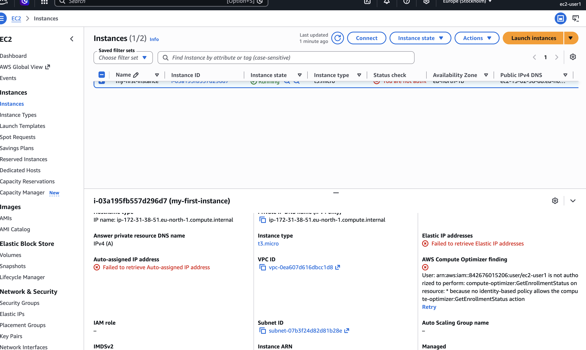
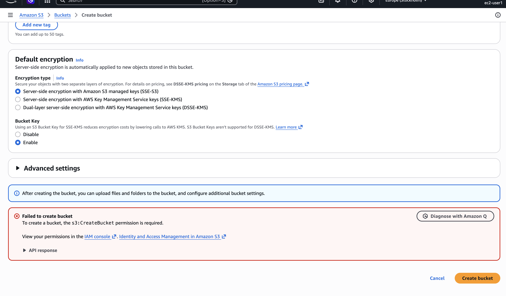
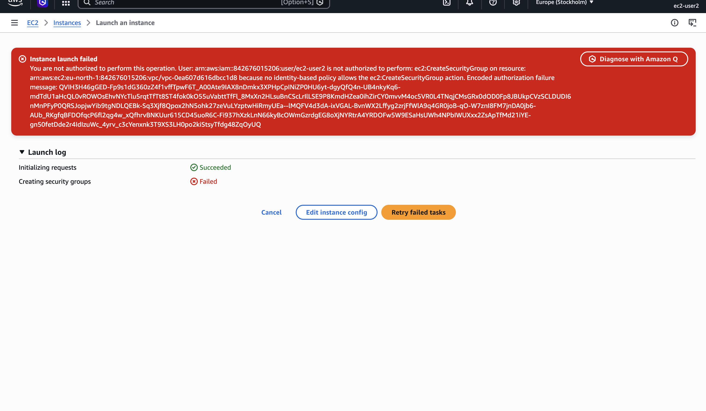
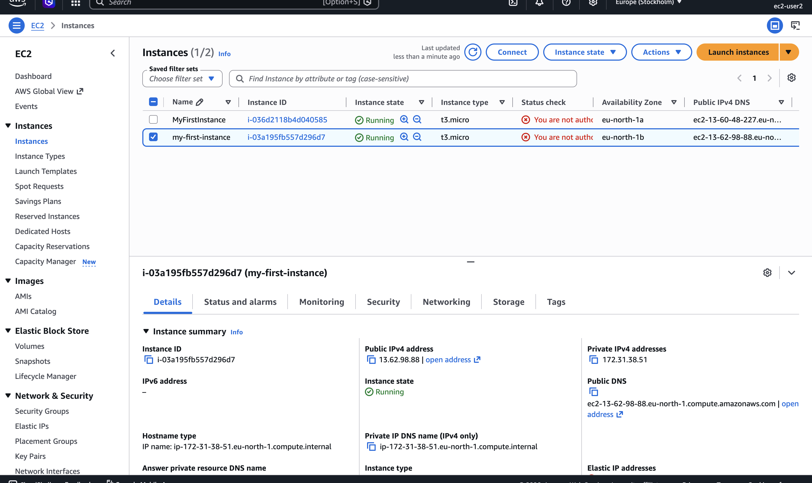
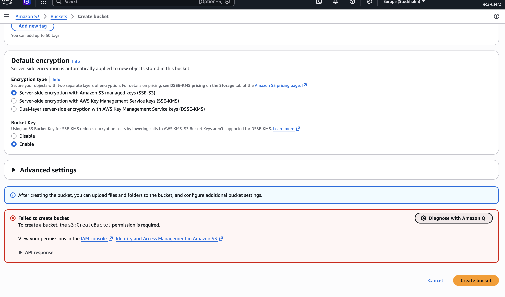
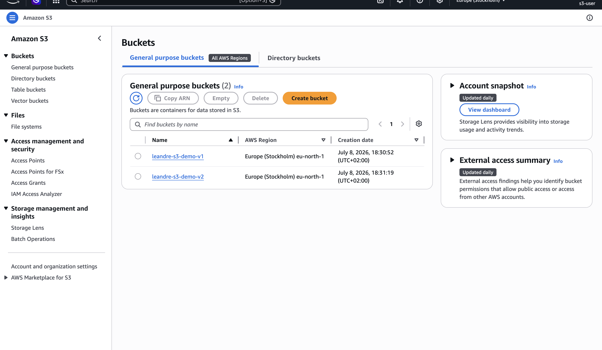
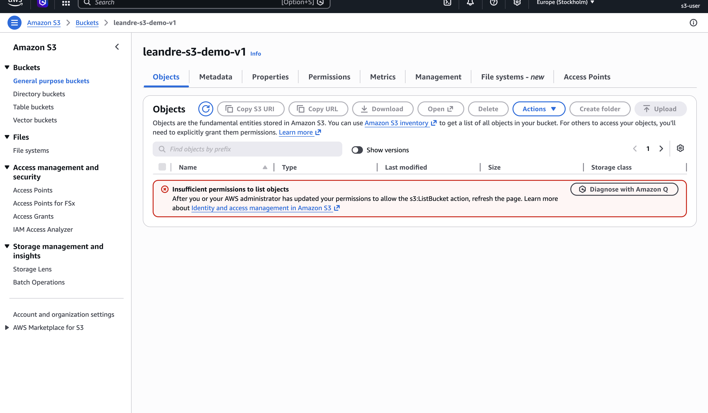
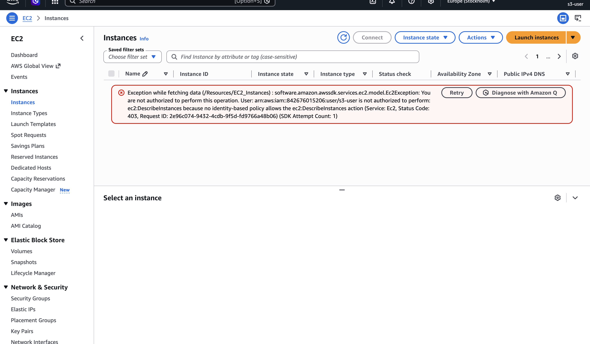

# Lab 01 — IAM users, groups and a shared temp password (with GitSync)

First CloudFormation template I've ever written. The task sounded simple on paper and took me a full afternoon, most of it spent on things that had nothing to do with the template itself.

## The task

Create a GitSync-enabled CloudFormation template that sets up:

- A one-time password, auto-generated and stored in Secrets Manager, shared by all users
- An S3 group that can list buckets
- An EC2 group that can list and create instances
- Three console users (`ec2-user1`, `ec2-user2`, `s3-user`) assigned to those groups, all using the temp password and forced to change it on first login
- `ec2-user2` must NOT be able to create EC2 instances, even though their group allows it

## How it works

The interesting part is `ec2-user2`. The group policy allows `ec2:RunInstances`, but an inline policy directly on the user explicitly denies it. In IAM, an explicit Deny always wins over any Allow, so the group can keep granting the permission to everyone else while this one user is blocked. Tested it live: user1 gets through, user2 hits the deny wall.

The password never appears in the template or the repo. `GenerateSecretString` creates it at deploy time, and the users pull it through a dynamic reference:

```
'{{resolve:secretsmanager:iam-temp-password:SecretString}}'
```

One catch: because the reference is just a name string, CloudFormation doesn't see the dependency, so every user needs an explicit `DependsOn: TempUserPassword`.

## Things that broke (in order)

Keeping this list because every single one will happen to me again.

1. **`AWSTemplateFormatVersion` is not today's date.** It's always `2010-09-09`. I put the current date, it's an invalid value.

2. **Logical IDs can't have hyphens.** I named a resource `ec2-user1` and CloudFormation rejected the template. Logical IDs are alphanumeric only; the hyphens go in `UserName`, which is the real resource name.

3. **IAM doesn't validate action names.** `service:s3:ListAllMyBuckets` deploys fine and matches nothing. Silent failure. Also, in a policy statement it's `Resource`, singular — I wrote `Resources` and got a MalformedPolicyDocument at deploy.

4. **I attached the deny policy to the wrong user. Twice.** cfn-lint was green both times. Lint checks that the template is valid, not that it's right. Read your own diff against the requirements.

5. **GitHub connection showed "Available" but no repos in the dropdown.** Authorizing the AWS connector and *installing* the GitHub App are two separate steps. The app was never installed on my account, so AWS could see my identity and zero repositories. Fixed at github.com/apps/aws-connector-for-github → Install → select the repo.

6. **GitSync needs TWO different IAM roles and I mixed them up.** One role is for GitSync itself (trust principal `cloudformation.sync.codeconnections.amazonaws.com`) — it reads the repo and triggers change sets. The other is the stack execution role (trust principal `cloudformation.amazonaws.com`) — it actually creates the resources, so it needs IAM and Secrets Manager permissions. The console dropdowns filter roles by trust policy, which is why a role that exists can still "not show up". When a dropdown looks broken, check the trust policy first.

7. **`deployment.yml` vs `deployment.yaml`.** The stack config said `.yaml`, my file was `.yml`. GitSync failed with a 404 in the sync events. One character. With GitSync there's no terminal yelling at you — you have to know where errors live: Git sync tab for sync/deployment issues, Events tab for resource provisioning issues.

8. **CLI runs as somebody, somewhere.** I configured the CLI with the lab user's keys by mistake and got AccessDenied fetching the secret (correct behavior — the user only has EC2 permissions). Then got ResourceNotFound because my default region is af-south-1 and the stack is in us-east-1. Secrets are regional, IAM users are global. `aws sts get-caller-identity` and `aws configure get region` before doubting anything else.

9. **My own template had a permissions catch-22.** `PasswordResetRequired: true` forces a password change, but changing your own password needs `iam:ChangePassword` — which I never granted. Users could log in and then couldn't complete the forced reset. Fixed in the template with a policy scoped to the calling user:

   ```yaml
   Resource: !Sub 'arn:aws:iam::${AWS::AccountId}:user/${!aws:username}'
   ```

   Two templating systems in one line: CloudFormation fills the account ID at deploy time, IAM resolves `${aws:username}` at request time (the `!` stops Sub from eating it). Pushed the fix to git and watched the stack update itself — the whole point of GitSync, and honestly satisfying after all the setup pain.

10. **Delete and recreate is not symmetric.** Deleted the stack, recreated it next day, stack said CREATE_COMPLETE but IAM was empty. The Resources tab showed only a GitSync wait-condition placeholder — the "Sync from Git" flow creates a shell stack first and the real resources come from the first successful deployment, which had failed quietly (deleted Secrets Manager secrets linger in a recovery window and block recreation by name). "Retry latest commit" fixed it. CREATE_COMPLETE means the last operation succeeded, not that the stack contains what you think.

## Verifying

```bash
# who am I / where am I
aws sts get-caller-identity
aws configure get region

# fetch the generated password (admin credentials, right region)
aws secretsmanager get-secret-value --secret-id iam-temp-password \
  --query SecretString --output text --region us-east-1
```

Then log in as each user in an incognito window (so the admin session survives), go through the forced password change, and try the actions: user1 can start launching an instance, user2 gets an explicit deny on RunInstances, s3-user sees the bucket list but nothing inside buckets (`ListAllMyBuckets` ≠ `ListBucket`).

## Task 2 — logging in as each user

Second part of the lab: sign in to the console as each IAM user and try to access both EC2 and S3, with screenshots of the result. Before clicking anything I wrote down what *should* happen, based on the policies — if a screenshot disagrees with this table, either the template or my understanding is wrong:

| User      | EC2                                        | S3                              |
|-----------|--------------------------------------------|---------------------------------|
| ec2-user1 | Can list instances, can launch             | Denied — no S3 permissions      |
| ec2-user2 | Can list instances, launch **denied**      | Denied — no S3 permissions      |
| s3-user   | Denied — no EC2 permissions                | Can list buckets (names only)   |

The console makes way more API calls than the permissions I granted, so even "successful" pages are full of permission errors around the edges (user1 can list instances but the dashboard still shows red boxes for volumes, security groups, etc.). That's expected with minimal policies, not a bug.

Reminder to self: EC2 is regional — the region picker has to be on us-east-1 or even user1 sees nothing. IAM users themselves are global.

### ec2-user1

EC2 — listing/launching works (Allow from the group policy):



S3 — denied, no policy grants anything on S3:



### ec2-user2

EC2 — can list instances, but launching hits the explicit Deny from the inline policy. Same group as user1, different outcome — this is the deny-overrides-allow proof:



EC2 — listing instances works, because the group policy allows it and there's no deny on that action:



S3 — denied, same as user1:



### s3-user

S3 — bucket list loads (`s3:ListAllMyBuckets`), but opening any bucket fails because that needs `s3:ListBucket`, which the group doesn't grant:



S3 — opening a bucket fails, as expected:



EC2 — denied, no EC2 permissions at all:



## Cleanup

Delete any access keys manually added to users first (resources modified outside the template can block stack deletion), then delete the stack. Force-delete the secret if you plan to recreate soon:

```bash
aws secretsmanager delete-secret --secret-id iam-temp-password \
  --force-delete-without-recovery --region us-east-1
```

Lint before every push: `cfn-lint lab-01/practice.yml`. It won't catch wrong-user bugs, but it catches everything else in seconds.