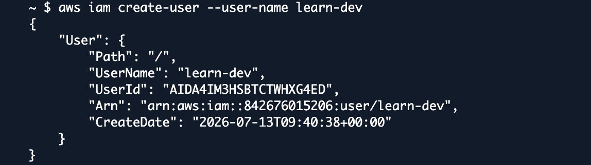
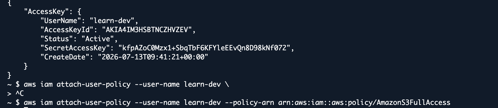
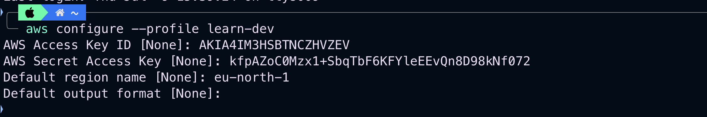
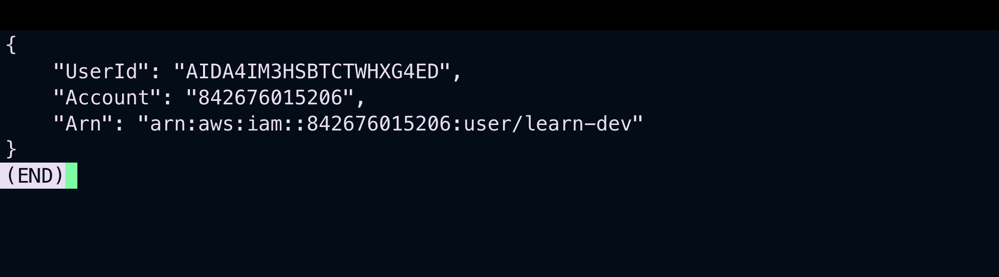
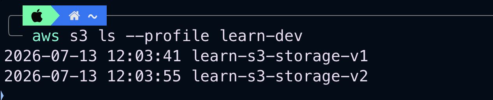
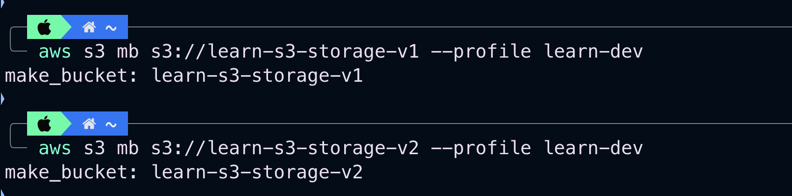
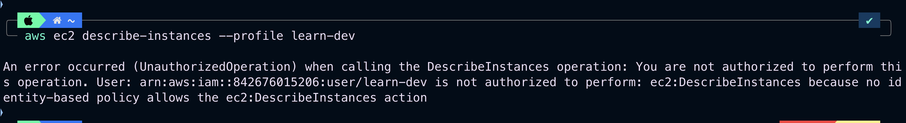
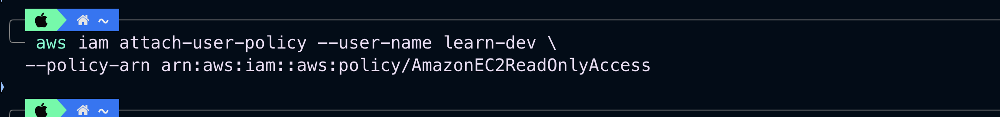

# Lab 02 — Testing IAM user permissions (CloudShell + CLI)

Lab 01 was declarative: write a template, let CloudFormation build everything, delete the stack to clean up. This one is the opposite — imperative. Every command mutates the account directly, there is no stack, and cleanup at the end is manual and on me. Doing both back to back makes it obvious why IaC exists.

Also different from lab 01: there the permissions came from *inline policies on groups*. Here it's an *AWS managed policy attached directly to a user* — the third place permissions can come from.

## The task

1. **(CloudShell)** Create an IAM user, create access keys for it, attach an AWS managed policy that lets the user create and view S3 buckets
2. **(Local CLI)** Configure the user's credentials as a profile, verify identity with STS, list buckets, create 2 buckets, try to list EC2 instances
3. **(Challenge)** Extend the user's permissions to allow viewing EC2 instances

## Task 1 — CloudShell

CloudShell is a terminal in the browser (the `>_` icon in the console top bar), pre-authenticated as whoever is logged into the console. No `aws configure`, no keys on disk — which is exactly why it's handy for admin one-offs like creating users.

```bash
aws iam create-user --user-name <user>

aws iam create-access-key --user-name <user>

aws iam attach-user-policy --user-name <user> \
  --policy-arn arn:aws:iam::aws:policy/AmazonS3FullAccess
```

Notes to self:

- `create-access-key` prints the SecretAccessKey **once**. No command retrieves it again. If it's gone, delete the key and create a new one.
- `attach-user-policy` outputs nothing on success. Verify with `aws iam list-attached-user-policies --user-name <user>`.
- On the policy choice: there is no AWS managed policy that is exactly "create + view buckets". `AmazonS3ReadOnlyAccess` can't create; `AmazonS3FullAccess` can do far more than the task needs (delete, versioning, bucket policies). I used FullAccess because the task says managed policy — but the precise version of this would be an inline or customer managed policy with just `s3:CreateBucket`, `s3:ListAllMyBuckets`, `s3:ListBucket`. Managed policies trade precision for convenience.
- The `aws` in the policy ARN (`arn:aws:iam::aws:policy/...`) is where an account ID would normally be — managed policies live in Amazon's account and are shared to everyone.

Screenshots:





## Task 2 — local CLI as the new user

One terminology trap in the task text: "create a login profile" — in AWS, `aws iam create-login-profile` sets a *console password* (it's what my lab 01 template's `LoginProfile` block was). What this task actually needs — everything after it is CLI commands — is a *named CLI profile*. Not the same thing at all.

The setup: my laptop's default profile stays as the sandbox admin, and the new user's keys go into a second named profile. Both end up in `~/.aws/credentials`, in plaintext — worth remembering what a stolen laptop means.

```bash
aws configure --profile learn-dev
```



First thing after configuring any profile — confirm who the CLI thinks it is *before* running anything else. In lab 01 I learned this reflex during a crisis; this time it's proactive:

```bash
aws sts get-caller-identity --profile learn-dev
```

The Arn ends in `user/<learn-dev>`, so the profile works.



Listing buckets works — `AmazonS3FullAccess` easily covers `ListAllMyBuckets`. An empty account gives an empty (but successful) response, which looks confusingly like nothing happened; `echo $?` returning 0 is the actual proof.

```bash
aws s3 ls --profile learn-dev
```



Creating the two buckets. The gotcha here is that bucket names are globally unique across *all* AWS accounts, not just mine — generic names have been taken for years. Name + date works: 

```bash
aws s3 mb s3://<name>-lab02-bucket-1-<date> --profile learn-dev
aws s3 mb s3://<name>-lab02-bucket-2-<date> --profile learn-dev
```

(Also: lowercase, numbers and hyphens only. `BucketAlreadyExists` doesn't mean my setup is broken — it means someone on Earth got there first.)



And the planned failure — EC2. Nothing in the user's single attached policy mentions EC2, so nothing allows it and nothing explicitly denies it: this is an **implicit deny**, the default state at the bottom of the IAM evaluation order. The error text says exactly that — "no identity-based policy allows the ec2:DescribeInstances action". (An *explicit* deny — like the one I gave ec2-user2 in lab 01 — words it differently: "with an explicit deny". The error message always tells you which of the two you hit.)

```bash
aws ec2 describe-instances --profile learn-dev
```



## Task 3 — challenge: allow viewing EC2

The task says "modify the user's permissions" without saying how — and by now I know three ways to do it: attach another managed policy, write an inline policy on the user, or put the user in a group. I went with the managed policy, and the reasoning matters more than the choice: the need here is generic ("read-only EC2"), AWS maintains exactly that policy, and it keeps the user's permissions legible — anyone auditing this user sees two self-describing policy names instead of parsing JSON. The moment the requirement gets specific (only this region, only tagged instances), managed policies can't express it and I'd write my own — like the deny policy in lab 01.

The read-only managed policies follow a guessable naming pattern (`AmazonS3ReadOnlyAccess`, `AmazonEC2ReadOnlyAccess`, `AmazonRDSReadOnlyAccess`...), so no docs needed for the ARN:

```bash
# in CloudShell, as admin — the user can't grant itself permissions,
# because iam:AttachUserPolicy is itself a permission it doesn't have
aws iam attach-user-policy --user-name learn-dev \
  --policy-arn arn:aws:iam::aws:policy/AmazonEC2ReadOnlyAccess

aws iam list-attached-user-policies --user-name learn-dev
```



Then the same command that failed in Task 2, from my machine:

```bash
aws ec2 describe-instances --profile learn-dev
```

This time it returns JSON with an empty list instead of AccessDenied:

```json
{
    "Reservations": []
}
```

Empty is not failure — the API answered "here are your zero instances". Together with Image 7 this is the whole lesson in two screenshots: same command, same user, one attached policy apart — implicit deny on one side, empty success on the other. (Why `Reservations` and not `Instances`: EC2 returns instances grouped by launch request, a structure dating back to the original 2006 API. Every script that queries instances ends up with `Reservations[].Instances[]` eventually.)

## Lab 01 vs lab 02

Same subject — IAM users and policies — opposite methods. Lab 01 was declarative: describe the end state, CloudFormation figures out the order, delete the stack and everything is gone. Lab 02 was imperative: every command mutates the account now, nothing tracks what I created, and cleanup is me remembering what I did and undoing it in the right order. For three commands, imperative is faster. For anything I'd have to recreate, explain to someone else, or clean up reliably — the template wins, and lab 02 is the proof by experience rather than by slogan.

## Cleanup

No stack this time, so manual teardown, in this order (keys and attached policies block user deletion):

```bash
aws iam delete-access-key --user-name learn-dev --access-key-id <key-id>
aws iam detach-user-policy --user-name learn-dev --policy-arn arn:aws:iam::aws:policy/AmazonS3FullAccess
# plus whatever Task 3 added
aws iam delete-user --user-name learn-dev
# and the 2 buckets created in Task 2:
aws s3 rb s3://<bucket-1>
aws s3 rb s3://<bucket-2>
```