# Lab 03 — Securely Deploying Resources in a VPC

Multi-AZ VPC with a public web tier and a private app tier, deployed entirely with CloudFormation (GitSync). No SSH anywhere — every instance is managed through Session Manager only.

## The task

- Custom VPC across two AZs: 2 public + 2 private subnets
- IGW for the public tier, one NAT Gateway **per AZ** for the private tier — no cross-AZ NAT dependency
- 4 EC2 instances: 2 public running Apache (installed via user data, page shows my name + the lab name), 2 private
- Least-privilege security groups: HTTP and ICMP only, no inbound SSH
- All instances managed exclusively via SSM Session Manager

## Architecture

```
                        ┌─────────────── VPC 10.0.0.0/16 ───────────────┐
        internet        │      AZ a                        AZ b         │
           │            │ ┌──────────────────┐  ┌──────────────────┐    │
          IGW ──────────┼─┤ public 10.0.0/24 │  │ public 10.0.1/24 │    │
           │            │ │  web-a (Apache)  │  │  web-b (Apache)  │    │
           │            │ │  NAT-A           │  │  NAT-B           │    │
           │            │ └───────┬──────────┘  └───────┬──────────┘    │
           │            │ ┌───────┴──────────┐  ┌───────┴──────────┐    │
           │            │ │ private 10.0.10  │  │ private 10.0.11  │    │
           │            │ │  app-a ──► NAT-A │  │  app-b ──► NAT-B │    │
           │            │ └──────────────────┘  └──────────────────┘    │
                        └───────────────────────────────────────────────┘
```

Each private subnet has its **own route table** pointing `0.0.0.0/0` at the NAT Gateway in its **own AZ**. That's the whole reason there are two private route tables: if both private subnets shared one table they'd necessarily share one NAT, and an outage in that NAT's AZ would cut off outbound internet for the *healthy* AZ too.

## Design decisions

- **No key pair in the template.** Not just "SSH blocked by security group" — there is no SSH credential in existence. Session Manager works because the SSM agent dials *out* on 443; it needs zero inbound rules, which is also why it works on the private instances (their agent reaches SSM through the NAT).
- **ICMP rules allow echo request only** (`FromPort: 8`), not all ICMP. For ICMP rules, From/ToPort are reused as type/code. Security groups are stateful, so the echo *reply* needs no rule.
- **The private tier's ICMP source is the public security group**, not a CIDR — "from any instance wearing that SG" is tighter than the whole VPC range and survives IP changes.
- **AMI comes from the public SSM parameter** `/aws/service/ami-amazon-linux-latest/al2023-ami-kernel-default-x86_64`, resolved at deploy time. No hardcoded region-specific AMI ID, no stale images. AL2023 also ships the SSM agent preinstalled.
- **The web page shows which AZ served it** (via IMDSv2 — AL2023 requires the token flow, plain IMDSv1 GETs are disabled). Opening both URLs side by side is visible proof of the multi-AZ deployment.
- **AZs picked with `!GetAZs`**, CIDRs as parameters — the template deploys in any region unchanged.
- **One template, deliberately.** At ~24 resources this is 5% of CloudFormation's 500-resource limit, and everything shares one lifecycle — created together, demoed together, torn down together. Nested stacks solve reuse across environments (and force the child templates into S3, which would break the GitSync push-equals-deploy workflow); cross-stack references (`Export`/`Fn::ImportValue`) solve *independent* lifecycles, at the cost of export lock-in. This lab has neither problem, so splitting would be structure for structure's sake. Modularity here is the file's ordering instead: network → routing → security → compute.

## Validation (live demo)

1. **Browser**: open both `PublicWebUrlA` / `PublicWebUrlB` stack outputs — same name and lab, different AZ on each page.

   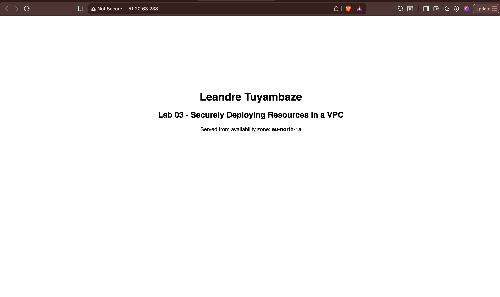
   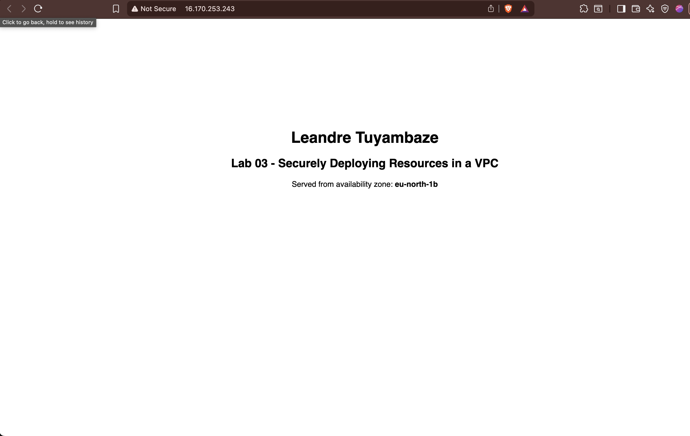

2. **All four instances managed by Session Manager** — the two private instances appearing in Fleet Manager already proves the NAT + SSM path before running a single command, since their agents can only reach Systems Manager through the NAT gateways:

   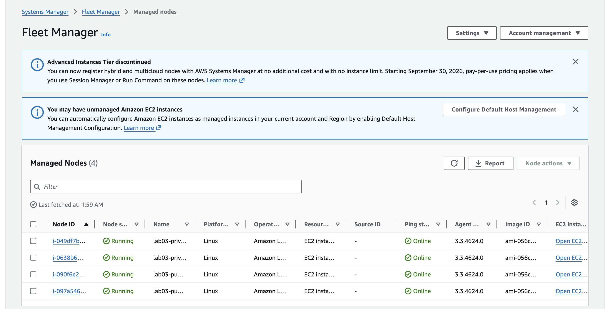

   A live session on a private instance — no public IP, no SSH, `hostname` shows the private subnet range:

   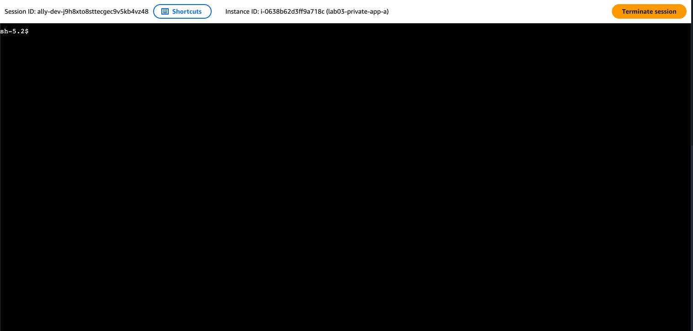

3. **Public → private ping** (Session Manager into a public instance, target IP from the `PrivateAppPrivateIpA` output):
   ```
   ping -c 3 10.0.10.x
   ```
   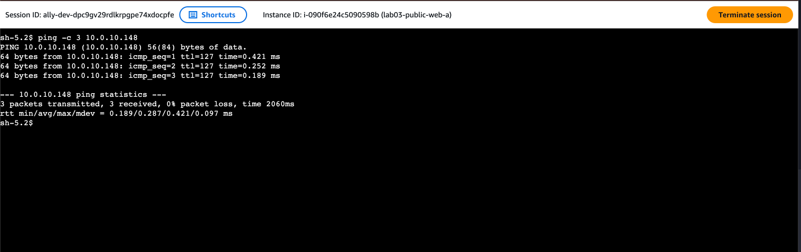

4. **Private outbound via NAT** (Session Manager into a private instance):
   ```
   sudo dnf install -y traceroute   # the install itself proves NAT egress
   traceroute -n amazon.com         # first hop is a 10.0.x.x address - the NAT path made visible
   ```
   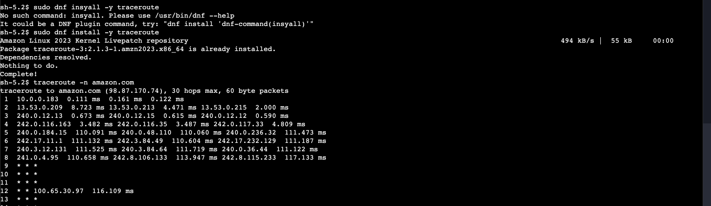

5. **Negative test**: `ping` a public instance from the internet fails (ICMP is VPC-scoped), and there is no port 22 to even attempt.

## Deployed evidence

The full stack — every resource from one template:

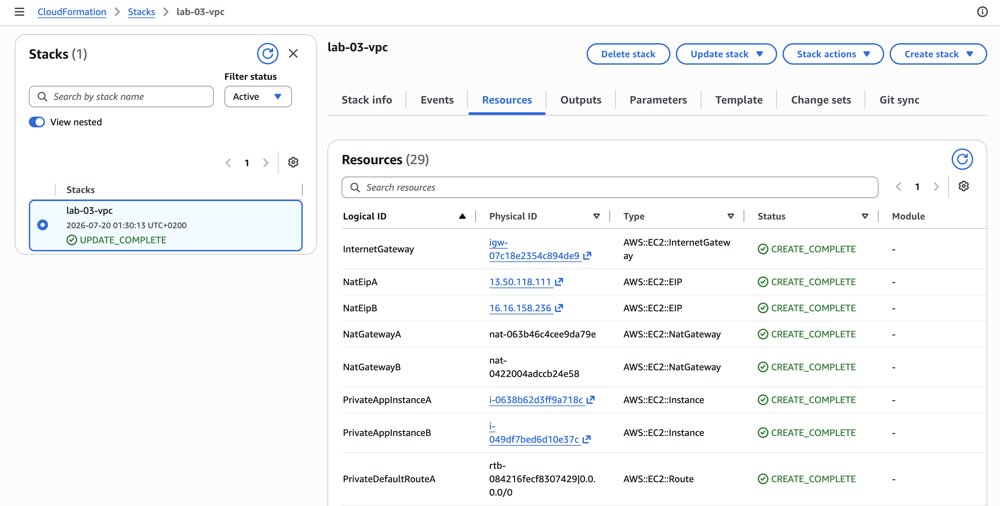
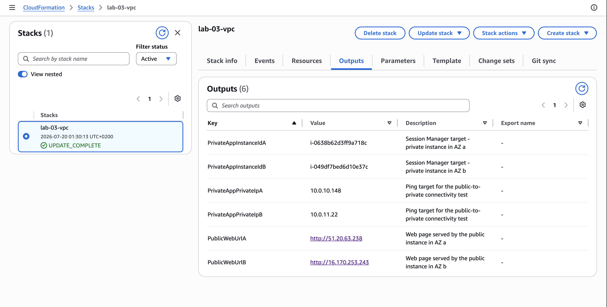

Four subnets across two AZs, and both NAT gateways in their own AZ:

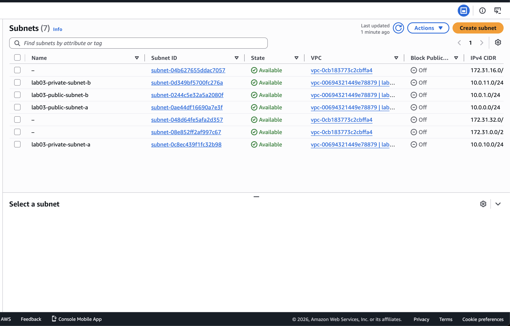
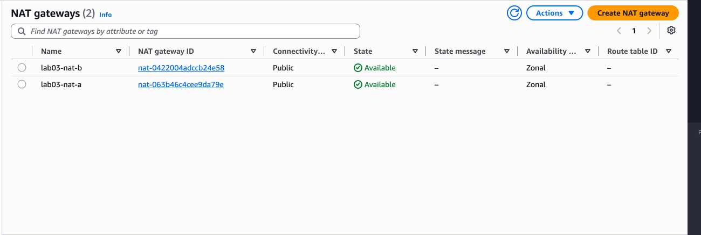

The AZ-alignment made visible — each private route table defaults to a *different* NAT gateway:

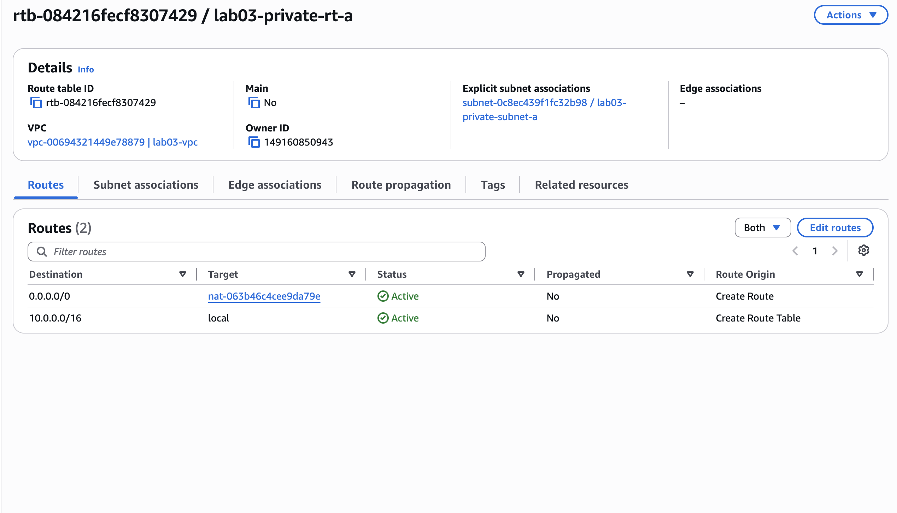
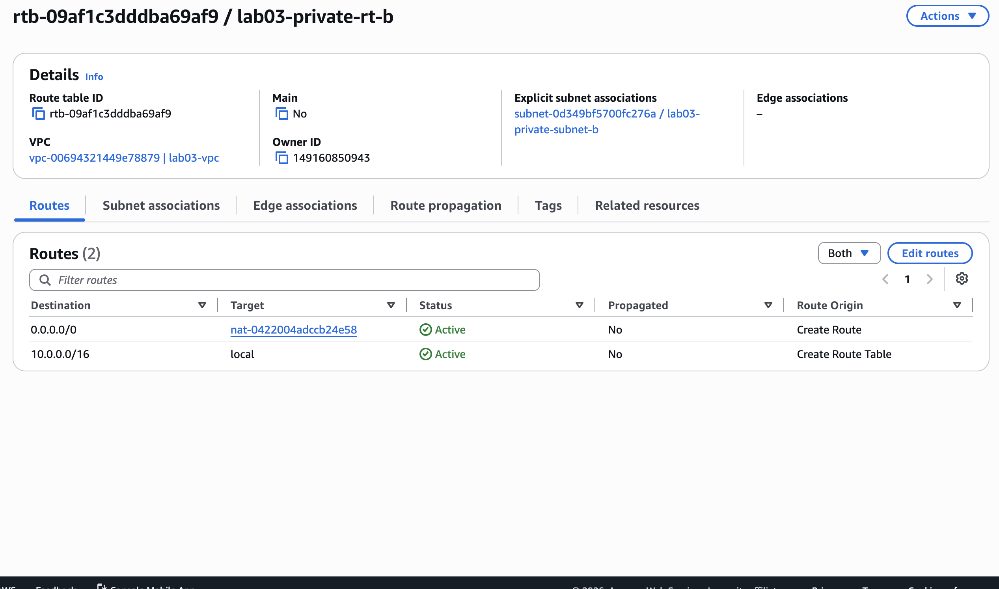

Least-privilege security groups — HTTP and ICMP echo only, port 22 nowhere:

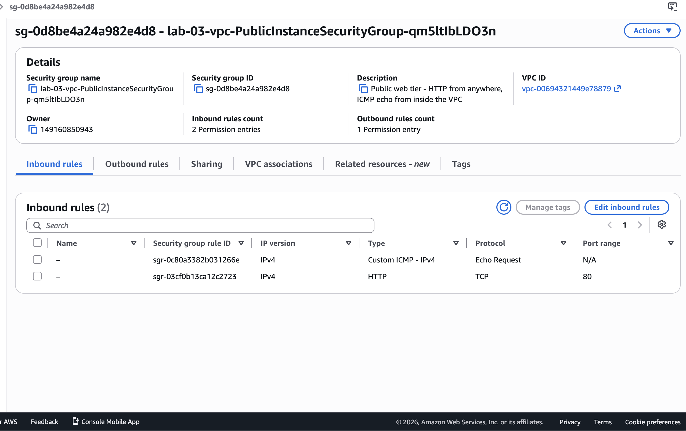
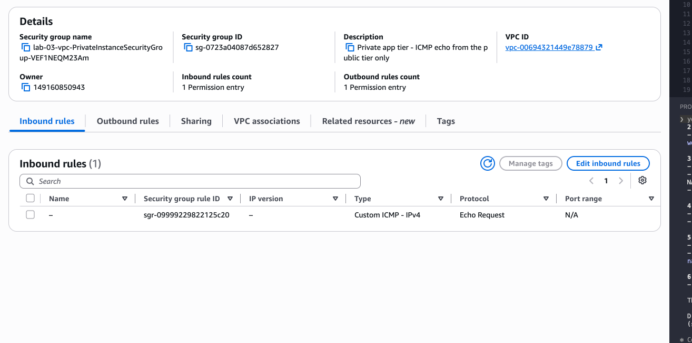

## What broke (GitSync IAM, three times)

The template deployed cleanly — the *pipeline* around it didn't. Three failures, each a different lesson:

1. **`cloudformation:DescribeStackEvents` denied for the sync role.** The GitSync role from lab-01 had its `Resource` pinned to that lab's literal stack name, so any new stack was invisible to it. Fix: widen the resource to `stack/lab-*` and `stack/lab-*/*` so future labs don't repeat this.
2. **`ssm:GetParameters` denied for the *execution* role.** GitSync involves **two different identities**: the sync role that talks to CloudFormation, and the stack execution role that CloudFormation assumes to build resources. The second one needed permissions for everything the template creates — EC2, scoped IAM actions for the instance role, `iam:PassRole` (condition-pinned to `ec2.amazonaws.com` — the permission to *hand* a role to a service, and the one everyone forgets), and `ssm:GetParameters` to resolve the AMI parameter. That last ARN has **no account ID** (`arn:aws:ssm:eu-north-1::parameter/...`) because it's a public parameter AWS owns — and it's resolved at change-set time, which is why it failed before a single resource existed.
3. **"Stack Sync configuration not found" (404).** The failed attempts left the stack half-linked — a `REVIEW_IN_PROGRESS` shell whose internal sync configuration never registered. Fix: delete the empty stack and recreate the Git sync link. `REVIEW_IN_PROGRESS` means "a change set was planned, nothing was ever built," so deleting it loses nothing.

## Rubric question: the Regional NAT Gateway

A **Regional NAT Gateway** is a single logical NAT gateway that spans every AZ in the VPC. AWS provisions and manages the underlying NAT capacity in each AZ automatically, keeps each AZ's traffic on same-AZ infrastructure, and absorbs AZ failures without any routing change on my side.

The classic NAT Gateway (what this lab uses) is **zonal**: it lives in one subnet in one AZ, and high availability is *my* job — one NAT per AZ, one private route table per AZ, each pointing at its own-AZ NAT. That per-AZ routing discipline is exactly what the two private route tables in this template implement by hand.

To replace the two NAT Gateways here: create one Regional NAT Gateway, point private `0.0.0.0/0` routes at it, and delete NAT-A/NAT-B with their EIPs. The two private route tables could then collapse into one, since there's no longer a per-AZ target to align — the AZ-alignment moves from my route tables into AWS's managed service. Trade-off: less explicit control and per-AZ visibility, in exchange for less to configure and no risk of someone breaking the AZ alignment later.

## Notes / what I learned

- A subnet is not "public" by any property on the subnet — it's public because its **route table** has an IGW route. `MapPublicIpOnLaunch` is the other half: without a public IP there's nothing for the IGW to translate to.
- CloudFormation can't infer that an IGW must be **attached** before a route can point at it — the public default route needs an explicit `DependsOn` on the attachment.
- In user data inside `!Sub`, `${FullName}` belongs to CloudFormation and `$TOKEN` (no braces) belongs to the shell. Mixing them up is the classic user-data bug.
- AWS reserves 5 IPs in every subnet, so a /24 has 251 usable addresses, not 256.
- GitSync runs as **two identities**: the sync role (talks to CloudFormation) and the execution role (builds the resources). An `AccessDenied` means nothing until you read *which* one was denied.
